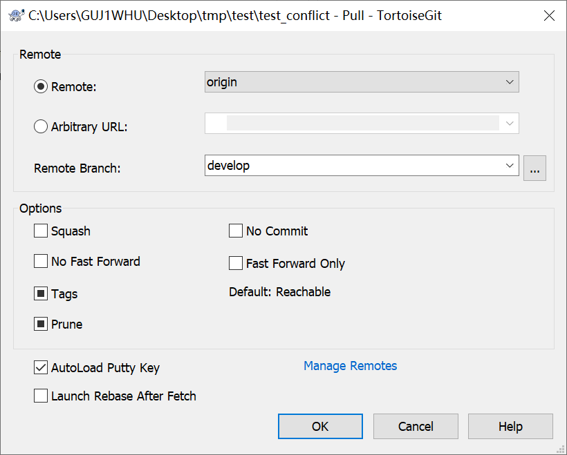

Gerrit 提交手册

## 1. 提交代码流程

### 1.1 背景(所有example以develop分支为开发分支)：

git clone 之后在本地进行开发，需要提交代码到代码仓库

### 1.2 操作流程：

#### 1.2.1 将开发的内容纳入git版本管理

**git bash**: git add .(添加本次修改的所有文件) --> git commit -m "XXX"

​    **tortoisegit**:Git  commit  -> "develop"   添加本次commit 信息

#### 1.2.2 同步远端的更新(提交之前必须要进行此操作)

**以下操作为pull的操作，如果不确定是否与远端修改了同一个文件，可参照第三章中的fetch+rebase的方式同步远端更新**

**git bash**:git pull <remote> <branch_name>

​    **tortoisegit**:

### 1.3 解决冲突并生成解决信息（仅限于pull，不支持fetch+rebase）

略

### 1.4 提交本次内容到远端仓库

**git bash**:

git push <remote> <branch_name>:refs/for/<branch_name>

**e.g.** git push origin develop:refs/for/develop

**tortoisegit**:

## 2. 修改不通过code review的提交的流程

### 2.1 最新提交

#### 2.1.1 修改本地的内容

略

#### 2.1.2 修改内容纳入git版本管理

**git bash**: git add --> git commit --amend

**tortoisegit**:

### 2.1.3 重新提交到gerrit

**git bash**:

git push <remote> <branch_name>:refs/for/<branch_name>

**e.g.** git push origin develop:refs/for/develop

**tortoisegit**:

### 2.2 非最新提交

以下面为例，需要重新提交被打回的commit1

commit 3 3rd push

commit 2 2nd push

commit 1 1st push

\# 开启rebase编辑菜单，需要改的commit前将pick改成edit

1. git rebase -i commit1^
2. 修改commit1的更新内容中有问题的部分
3. git add .
4. git commit --amend
5. git rebase --continue
6. git push origin develop:refs/for/develop
7. 此时commit3 commit2的提交会同步commit1的更新，并生成一个新的patch set

### 2.3 校验

主要校验内容为是对应修改的另一个版本，而非一个新的提交,如图中所示已经为**patchset2**版本

# 3. merge conflict处理流程

### 3.1 背景

我和别人同一个父节点，但别人的提交先合并入库 我的还没有入库 或者 提交之前没有同步远端的更新**更糟糕的是我们的提交都修改了同一个文件的同一行**

### 3.2 解决方案

#### 3.2.1 同步更新到本地

**git bash**: git fetch origin

​				git rebase origin <branch_name>

**tortoisegit**:

#### 3.2.2 解决冲突并合并到本地

**git bash** : git add .

​				git rebase --continue

**tortoisegit**:

图1为共同的父节点A

图2为本地开发的内容C

图3为远端最新的节点B

图4为解决冲突后的C

点击 resolved 如下图所示

解决完后，点击commit

#### 3.2.3 提交到gerrit

**git bash**:

git push <remote> <branch_name>:refs/for/<branch_name>

**e.g.** git push origin develop:refs/for/develop

**tortoisegit**:

### 3.3 校验

主要校验内容为是对应修改的另一个版本，而非一个新的提交,如图中所示已经为**patchset2**版本

